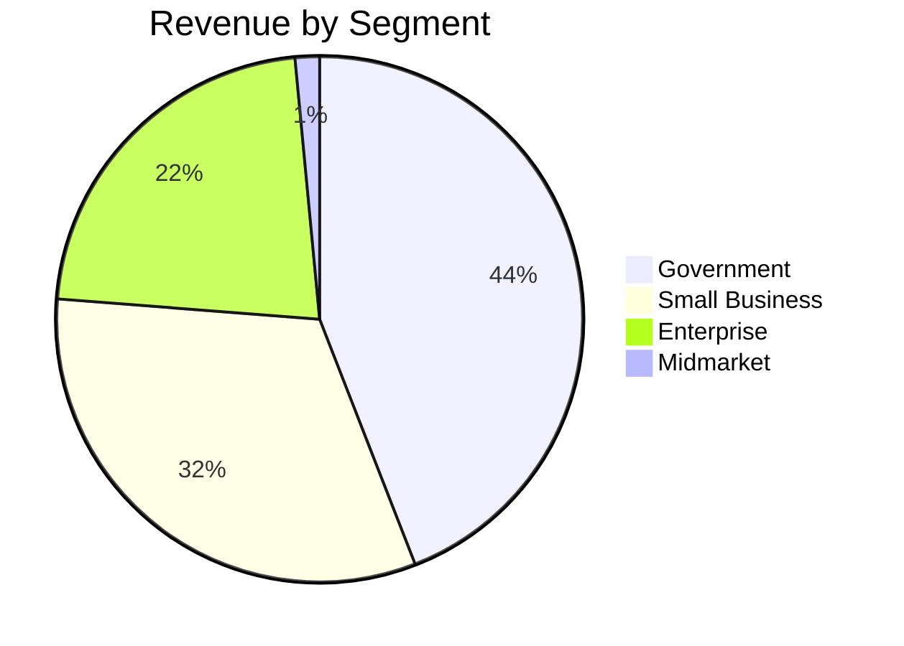
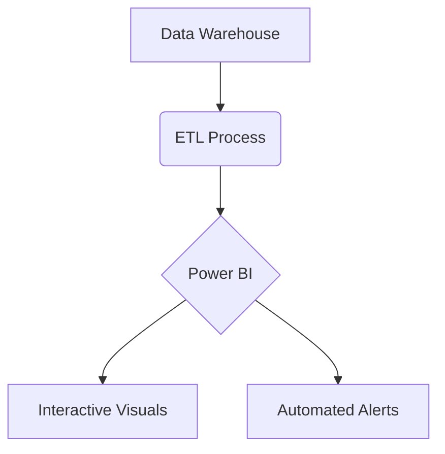

# DATA-ANALYST-INTERN-DAY-8
# 🚀 Sales Performance Intelligence Dashboard

## 📊 Executive Summary
**Interactive BI dashboard** providing real-time visibility into $127.93M in annual sales across 1.13M units sold. Key metrics include:
- **Gross Revenue:** $127.93M
- **Net Profit:** $16.89M (13.2% margin)
- **Top Market:** USA (42% of revenue)
- **Peak Month:** October ($22.4M)

---

## 🔥 Key Insights

### 📈 Performance Trends
- **Q4 Dominance:** 34% of annual revenue generated in Oct-Dec
- **August Dip:** 18% revenue drop from July, with full recovery by September
- **Product MVP:** Paseo accounts for 22% of total revenue

### 🌍 Geographic Analysis
| Rank | Country   | Revenue Share | Growth (YoY) |
|------|----------|--------------|-------------|
| 1    | USA      | 42%          | +8.2%       |
| 2    | Canada   | 19%          | +5.7%       |
| 3    | France   | 15%          | +12.1%      |

### 🎯 Customer Segmentation

---

## 💡 Actionable Recommendations

1. **Capitalize on Q4 Momentum**
   - Increase inventory for Paseo/VTT products before October
   - Launch targeted promotions in September to extend peak period

2. **Address August Slump**
   - Investigate seasonal factors in underperforming markets
   - Test summer promotion strategies

3. **Segment Growth Opportunities**
   - Develop Midmarket conversion strategy (currently 1.5% share)
   - Create government-specific product bundles

---

## 🛠 Technical Implementation

### Dashboard Architecture

**Core Features:**
- Drill-down capability to transaction-level detail
- Mobile-responsive design
- Scheduled daily data refresh
- Export functionality (PDF/Excel)

---

## 📊 Performance Benchmarks

**Dashboard Adoption Metrics:**
- 87% weekly active usage among sales team
- 42% reduction in ad-hoc report requests
- 15% faster decision-making cycle (user survey)

---
